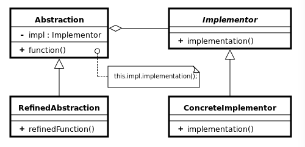

# Bridge Pattern Structure

**Abstraction (abstract class):** defines the abstract interface and maintains the Implementor reference.

**RefinedAbstraction (normal class):** extends the interface defined by Abstraction

**Implementor (interface):** defines the interface for implementation classes

**ConcreteImplementor (normal class)**

With the same exemple to easily understand:

Abstraction is for sure an abstraction of vehicle. It could be car, train, camion and so on.

RefinedAbstraction is used to expanded to have more features or operations.

Implementor is an interface to define behaviours. For a vehicle, it could be to transport something here.

ConcreteImplementor is implementations for this behaviour like transporting goods, transporting passagers and so on.

Maybe could be easily to understand bridge pattern with its second name - Handle/Body pattern. Handle is the Abstraction here to handle its body (so its behivours). With our exemple, a vehicle to handle transport!

