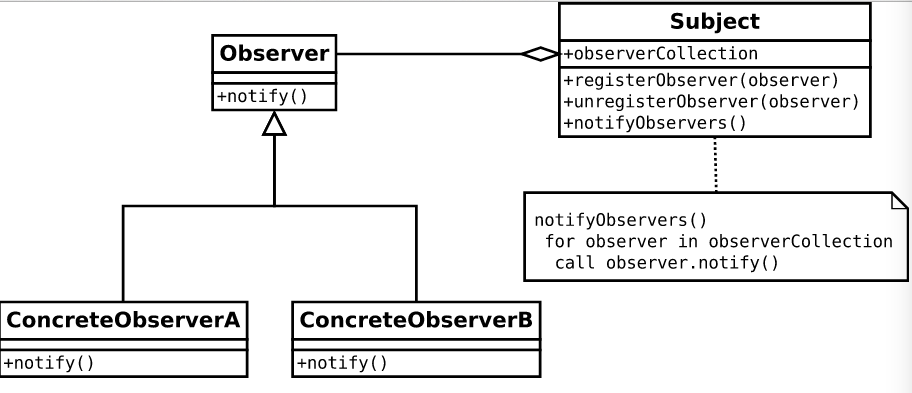

# Observer Pattern Structure

#### Subject：

The one to be observed. Also called observable. It will keep a list to store all the observers. When it changes its state. It will notify all the observers stored in the list.

#### Observer：

An interface for all the observers. It has only one function notify() which will be called when Subject changes its state.

#### ConcreteObserver：

They need to implement notify(), so when Subject changes its state. They could have the right reaction.

