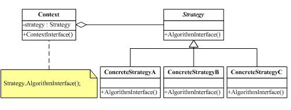

# Strategy Pattern Structure

#### Strategy

Defines an interface common to all supported algorithms. Context uses this interface to call the algorithm defined by a ConcreteStrategy.

#### ConcreteStrategy

Each concrete strategy simple implements Strategy interface.

#### Context

Context has a reference of Strategy. It separates stragegy itself and its duty (How it should be used). Client will use Context to add/change one Strategy. And Client can swap ConcreteStrategys in and out without effecting our Context.

For more details, the context object receives requests from the client and delegates them to the strategy object. Usually the ConcreteStartegy is created by the client and passed to the context. From this point the clients interacts only with the context. So a new strategy can effect that much on Client. A Client only needs to know those Strategy existing.

